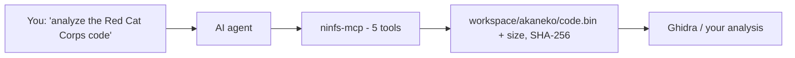

# ninfs-mcp

[日本語](README.ja.md)

[](LICENSE)
[](#install-in-one-line)
[](https://www.python.org/)
[](#connect-your-ai-client)
[](#for-developers)

> [!TIP]
> **One line, one prompt, one analyzed binary.**
> You say *"get the Red Cat Corps executable ready for analysis"* — the AI handles
> SD detection → read-only mount → update-first title resolution → decompressed
> code extraction → cleanup. Your SD card is never written to.

## Contents

- [How it works](#how-it-works-30-seconds)
- [Install in one line](#install-in-one-line)
- [Tell it these four paths](#tell-it-these-four-paths)
- [Connect your AI client](#connect-your-ai-client)
- [What the AI can (and cannot) do](#what-the-ai-can-and-cannot-do)
- [Analyze with Ghidra](#analyze-with-ghidra-recommended)
- [Troubleshooting](#troubleshooting)
- [For developers](#for-developers)

## How it works (30 seconds)



> [!NOTE]
> The AI only ever receives file *metadata* (path, size, hash) — never ROM
> contents, never your `movable.sed` / `boot9.bin` / SD key.

## Install in one line

> [!IMPORTANT]
> One-time requirements: Windows + WinFsp 2.x, a C++ compiler (for one
> dependency), your SD backup, and that console's `movable.sed` + `boot9.bin`.

- [x] Steps the installer takes for you:
  - [x] Fetch the code (git or zip)
  - [x] Build an isolated venv + install + `--help` smoke test
  - [x] Register the server in detected clients (**backups first**)

```powershell
& ([scriptblock]::Create((irm https://raw.githubusercontent.com/Fizor-drm/ninfs-mcp/main/tools/install.ps1))) `
  -Workspace C:/analysis -Movable G:/keys/movable.sed -Boot9 G:/keys/boot9.bin
```

> [!WARNING]
> Approve the UAC prompt if one appears (toolchain/SDK setup), then **restart
> your AI client** to load the server.

Prefer manual setup? `powershell -File tools/setup.ps1`, then point your client at
`.venv\Scripts\python.exe -m ninfs_mcp.server` ([examples below](#connect-your-ai-client)).

## Tell it these four paths

| Setting | What it is | Required? |
|:---|:---|:---:|
| `NINFS_WORKSPACE` | Folder where extracted files go (created if missing) | ✅ |
| `NINFS_MOVABLE_PATH` | Your `movable.sed` | ✅ |
| `NINFS_BOOT9_PATH` | Your `boot9.bin` | ✅ |
| `NINFS_SD_ROOT` | Your `Nintendo 3DS` folder | ➖ auto-detected |

> [!NOTE]
> Only *paths* are configured. Contents are never read except by ninfs to mount.

## Connect your AI client

<details open>
<summary><b>Claude Code CLI</b> — one line</summary>

```powershell
claude mcp add ninfs-mcp --transport stdio `
  --env NINFS_MOVABLE_PATH=G:/keys/movable.sed `
  --env NINFS_BOOT9_PATH=G:/keys/boot9.bin `
  --env NINFS_WORKSPACE=C:/analysis `
  -- C:/path/to/ninfs-mcp/.venv/Scripts/python.exe -m ninfs_mcp.server
```
</details>

<details>
<summary><b>Claude Code / OpenCode</b> — JSON</summary>

```json
{
  "ninfs-mcp": {
    "command": "C:/path/to/ninfs-mcp/.venv/Scripts/python.exe",
    "args": ["-m", "ninfs_mcp.server"],
    "env": {
      "NINFS_MOVABLE_PATH": "G:/keys/movable.sed",
      "NINFS_BOOT9_PATH": "G:/keys/boot9.bin",
      "NINFS_WORKSPACE": "C:/analysis/workspace"
    }
  }
}
```
</details>

<details>
<summary><b>Claude Desktop</b> — one click</summary>

`python tools/build_mcpb.py`, then drag `dist/ninfs-mcp.mcpb` into
Settings → Extensions and fill in the four paths.
</details>

<details>
<summary><b>Cursor / VS Code / Windsurf / Cline</b></summary>

Same JSON as above, in the host's MCP config file
(`mcp.json` / `mcp_config.json` / `cline_mcp_settings.json` /
`.vscode/mcp.json` under `servers`).
</details>

## What the AI can (and cannot) do

| ✅ Can | 🚫 Cannot |
|:---|:---|
| Detect SD, mount read-only | Write to, or delete from, the SD card |
| Pick update data over base game | Run arbitrary commands (5 tools only) |
| Copy files *into your workspace* | See file contents, keys, or secrets |
| Unmount + clean up everything | Leave mounts behind (auto-cleaned on exit) |

> [!CAUTION]
> Copy destinations are locked inside your workspace — `..`, absolute paths,
> drive specs, UNC paths and reserved names are all rejected.

## Analyze with Ghidra (recommended)

Verified companions: **Ghidra 12.1.4** + Java 21, plus **ghidra-ctr-loader
v1.3.0** in `Ghidra/Extensions`. Start headless with
`JAVA_TOOL_OPTIONS=-Xmx8G` (`analyzeHeadless` rejects `-Xmx` itself).

```powershell
& "<ghidra>/support/analyzeHeadless.bat" <projdir> <proj> `
  -import <code.bin> -processor "ARM:LE:32:v7" -loader BinaryLoader -loader-baseAddr 100000
```

That took a 5.7MB `.code` to **15,194 functions**. Two gotchas we hit so you
don't have to:

1. `-loader` wants the Loader **class** name (not the display name).
2. There is no `-baseAddr` — use `-loader-baseAddr <hex, no 0x>`.

> [!NOTE]
> Mounting a CXI container directly can run out of memory on some titles
> (loader-side issue). Raw import is the reliable path.

## Troubleshooting

| Symptom | Fix |
|:---|:---|
| `--help` fails with a FUSE error | WinFsp isn't installed or running — even `--help` needs it |
| `haccrypto` won't build | Install VS Build Tools (“Desktop development with C++”), re-run the installer |
| Mount fails / hangs | Don't pre-create mount points — WinFsp creates and deletes them itself |
| Leftover process after cancel | Kill it; next `unmount`/startup sweeps residuals automatically |

## For developers

67 tests, all mocked — `python -m pytest tests/`. MIT — see [LICENSE](LICENSE).
