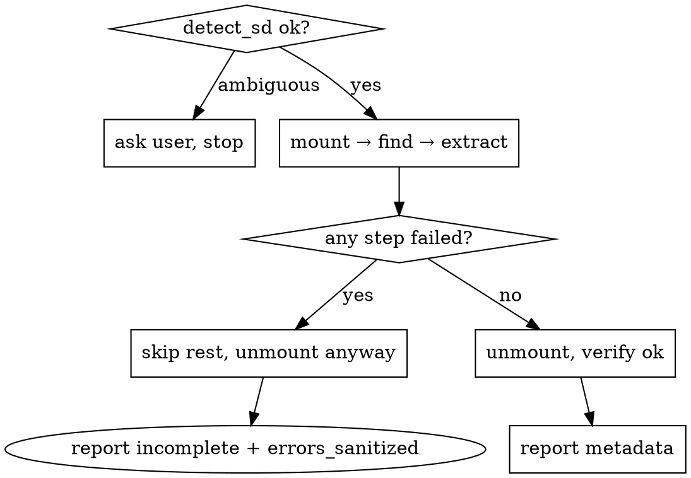

# Using ninfs-mcp

## Overview

ninfs-mcp exposes 3DS SD analysis as five MCP tools. Call the MCP tools —
never `runner` internals. Mounts are read-only; secrets stay masked.

## Tool signatures

| Tool | Args | Returns |
|:---|:---|:---|
| `detect_sd` | — | `{sd_root, has_n3ds_dir, has_boot9, has_movable}` or `{error: ambiguous, candidates}` |
| `mount_sd` | — | `{mount_id, mount_point}` |
| `find_title` | `mount_id`, `title_id` (16 hex) | `{requested_title_id, resolved_title_id, kind, tmd_found, title_handle}` |
| `extract_code` | `title_handle`, `dest_rel` | `{dest_path, size, sha256, code_entry}` metadata only |
| `unmount` | `mount_id` | `{ok, incomplete, errors_sanitized}` |

## Flow (in order, no skipping)

1. `detect_sd` — success shape above. `ambiguous` means ask the user; never guess.
2. `mount_sd` — keep the `mount_id`.
3. `find_title(mount_id, base_id)` — update-first is the default. Use `resolved_title_id` downstream, never the requested ID. Passing an update ID resolves it directly with no base fallback.
4. `extract_code(title_handle, "<name>/code.bin")` — returns metadata only.
5. `unmount(mount_id)` — verify `ok: true, incomplete: false`. Always last, even on failure.

## Rules

- One title per flow. A new title means a new `find_title` (handles are per-title).
- `dest_rel` convention: `<requested-id-lowercase>/code.bin` or `<game-name>/code.bin`.
- Never print or return boot9/movable contents, SD keys, or full secret paths.
- Never skip `unmount`. On failure, unmount anyway, then report `incomplete` plus `errors_sanitized`.

## Common mistakes

- Driving `runner.*` directly (bypasses the sanitizer and response mapping) — use the `server.*` MCP tools.
- Forgetting `unmount` — leaked WinFsp mounts survive the session. Verify `ok`.
- Assuming the base title was used — check `kind` (`base` or `update`).
- Passing a base ID and expecting base output — update-first resolves updates by default.
